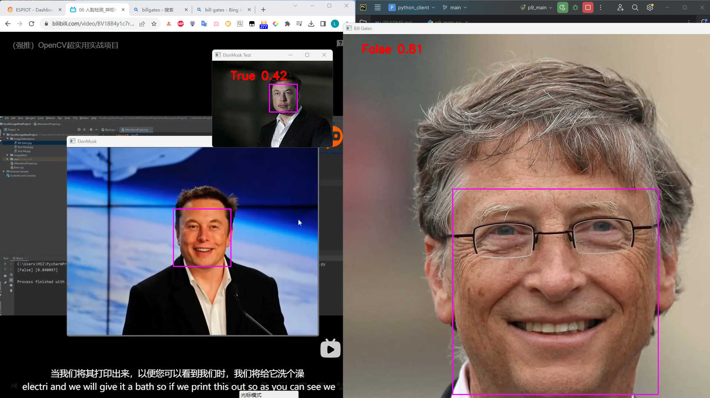

## Install VS C++

it's big, just wait it in ☕
then restart the computer.

## Install Python Dependencies
pip install cmake==3.27.9 dlib==19.24.2 face-recognition==1.3.0 numpy==1.26.2 opencv-python==4.8.1.78  

## 测试图片
./ImageBaseic/*.png

## 结果
### codefile: p9_main.py

